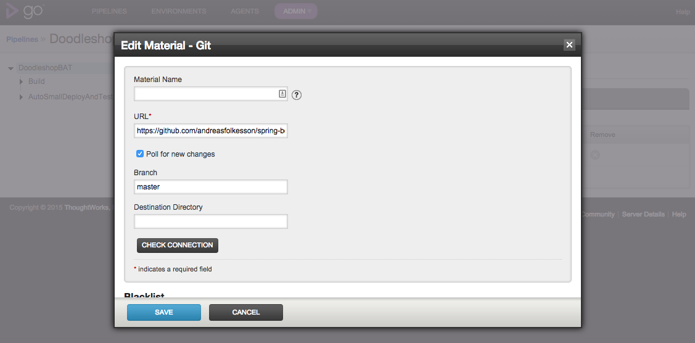
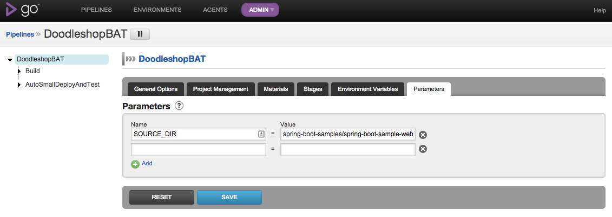

dockerApplicationServer
=======================

## Starta med Docker-compose

Installera boot2docker: http://boot2docker.io/

Öka minnet i virtualbox till 4GB från 2GB:

    $ boot2docker delete
    $ boot2docker init -m 4096

Starta boot2docker:

    $ boot2docker up

Installera Docker compose enligt http://docs.docker.com/compose/install/

Starta pipelinen:

    $ docker-compose up
 
Om du kör Mac OSX, ta reda på ip-adress. På Linux fungerar localhost:

    $ boot2docker ip

Öppna en webbläsare på 

    http://<ip>:28153/go

För att starta en till agent och skala upp miljön:

    $ docker-compose scale goagent=2

doodleshop (applikationen) i produktion: http://ip:58080

Övriga portmappings (samma för vagrant varianten):

Port | Tjänst
------|--------
28080 | autosmall
38080 | autolarge
48080 | man
58080 | prod

## Starta med Vagrant

Starta med:

    vagrant up --no-parallel --provider docker

Förutsättningar:

   VirtualBox
   Vagrant från vagrantup.com (1.6.5 eller nyare). Om man har 1.6.5 så behöver patch enligt beskrivning längst ner läggas in.

Surfa därefter till:

    http://127.0.0.1:28153/go för go:

och:

   http://127.0.0.1:58080 för doodleshop i produktion

### Patch för Vagrant 1.6.5

Ändringen från:

https://github.com/mitchellh/vagrant/commit/57a1269e353c7858d6989dd42e5e96c416344755#diff-c96c34335d9512cac6d05cc227bd8189

behöver läggas in för att man inte ska få problem när man laddar hem färdiga docker images.

#### Exempel på Mac OS med Vagrant installerat från vagrantup 

(till Applications/Vagrant/embedded/gems/gems/vagrant-1.6.5)
Ändra filen /plugins/providers/docker/driver.rb, leta reda på rad 56:

    execute(*run_cmd.flatten, **opts, &block).chomp

och lägg in

    .lines.last 

på slutet

## Anpassa ett annat projekt

För att anpassa ett annat projekt med minimala förändringar till pipelinen i GO måste man lägga till scripts som 
pipelinen använder för att köra test samt konfigurera Dockerfile

Ett komplett exempelprojekt ligger här: https://github.com/andreasfolkesson/spring-boot vilket är en fork av spring boot.
Exempelprojektet "spring-boot-samples/spring-boot-sample-web-ui/" är anpassat genom att lägga till scriptsktatalogen
och testskatalogen samt en förändring i Dockerfile och pom.xml.

För att köra detta projektet genom pipelinene, ändra git URL'en under Materials i DoodleshopBAT till: 
"https://github.com/andreasfolkesson/spring-boot".

Editera DoodleshopBAT pipelinen och gå till "Parameters". Sätt 
"spring-boot-samples/spring-boot-sample-web-ui/" som värdet för SOURCE_DIR.

